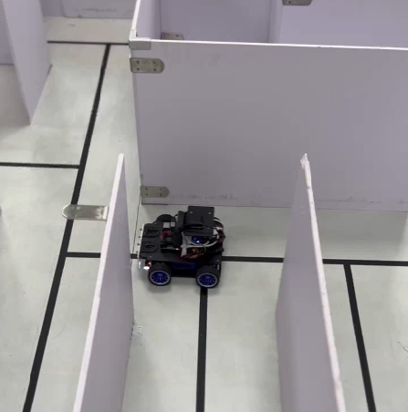

# MazeTreasureHunter

这是一个用于探索迷宫中宝藏的系统，通过图像处理（OpenCV/YOLO）识别宝藏，通过Dijkstra算法搜索不同节点之间的最短路径，结合推理判断通过贪心/DFS算法选择最优路径。

本项目基于2023年光电设计大赛作品，时隔两年，重构完善代码。



## 项目结构

```bash
├── assets # 存放项目所需的图片、视频等资源文件
├── docs # 存放项目文档
├── config # 存放项目配置
├── models # 存放项目迷宫、宝藏的数据模型
├── algorithms # 存放项目算法
├── controllers # 存放项目控制器
├── ui # 用于界面可视化
├── utils # 存放项目工具函数
├── main.py # 项目入口文件
├── README.md # 项目说明
└── requirements.txt # 项目依赖
```

## 使用方法

### 环境要求

- Python 3.10
- UV包管理工具

### 环境配置

- 安装UV工具：

```Powershell
pip install uv
```

- 创建Python 3.10虚拟环境：

```Powershell
uv venv --python=3.10
```

- 激活虚拟环境：

   Windows:

   ```Powershell
   .\.venv\Scripts\activate
   ```

   Linux/Mac:

   ```bash
   source .venv/bin/activate
   ```

- 安装项目依赖：

```Powershell
# 从requirements.txt安装依赖
uv pip install -r requirements.txt
```

- 验证Python版本：

```Powershell
python --version
```

确保输出为Python 3.10.x

### 运行程序

```bash
python main.py
```

## TODO

- [ ] 补充YOLO模块
- [ ] 修复搜索算法模块
- [ ] 补充RL算法模块
- [ ] 补充硬件交互模块
